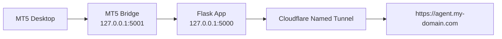

# Local Deployment Guide

Gold Smart Agent is now local-first. The recommended production shape is:



Render files remain in the repo for optional future hosting, but MT5 Direct Mode is designed to run from the local Windows PC.

## Install

1. Install Python 3.11.
2. Install Git for Windows.
3. Install MetaTrader 5 and log in.
4. Install `cloudflared`.
5. From the project folder:

```powershell
py -3.11 -m venv .venv
.\.venv\Scripts\python.exe -m pip install -r requirements.txt
.\.venv\Scripts\python.exe -m pip install -r requirements-mt5-bridge.txt
```

## Environment

Copy `.env.example` to `.env` and edit:

```text
APP_MODE=local
PUBLIC_BASE_URL=https://agent.my-domain.com
FLASK_PORT=5000
MT5_BRIDGE_PORT=5001
MT5_BRIDGE_URL=http://127.0.0.1:5001
MT5_BRIDGE_API_KEY=change-this-local-secret
```

Use a long random value for `MT5_BRIDGE_API_KEY`.

## Startup

Recommended:

```cmd
start_all.bat
```

Separate windows:

```cmd
start_mt5_bridge.bat
start_local.bat
start_cloudflare_tunnel.bat
```

Open locally:

```text
http://127.0.0.1:5000
```

## Cloudflare Named Tunnel

Create a named tunnel in Cloudflare, then copy:

```text
config/cloudflare/tunnel.yml.example
```

to:

```text
config/cloudflare/tunnel.yml
```

Set the hostname to your domain:

```yaml
ingress:
  - hostname: agent.my-domain.com
    service: http://127.0.0.1:5000
  - service: http_status:404
```

Then run:

```cmd
start_cloudflare_tunnel.bat
```

## MT5 Bridge

The bridge is Windows-only because the `MetaTrader5` Python package talks to the installed desktop terminal.

Endpoints:

```text
GET /api/mt5/status
GET /api/mt5/account
GET /api/mt5/xauusd/candles?timeframe=H1&limit=300
GET /api/mt5/xauusd/snapshot
```

The Flask app calls the bridge through `MT5_BRIDGE_URL`.

## MT5 Auto-Push EA

Use:

```text
mt5/GoldSmartAgent_AutoPushOHLC_EA_V4.mq5
```

Set `InpEndpoint` to:

```text
https://agent.my-domain.com/api/analyze
```

In MT5, allow WebRequest for:

```text
https://agent.my-domain.com
```

The EA supports:

- Smart System A
- UPAS Trade Assistant
- Wave Structure Analyst
- Elliot Wave 3 Analysis
- OHLCV upload
- H1/H4 screenshot upload

## Health Checks

Local app:

```text
GET /health
GET /api/status
```

Bridge:

```text
GET http://127.0.0.1:5001/api/mt5/status
```

## Troubleshooting

- If MT5 Direct Mode fails, confirm MT5 is open and logged in.
- If `/api/status` says bridge unreachable, run `start_mt5_bridge.bat`.
- If public access fails, run `start_cloudflare_tunnel.bat`.
- If EA push fails, check MT5 WebRequest allowed URL and `InpEndpoint`.
- If history is empty, wait for a push cycle or run MT5 Direct Mode.

## Optional Render Use

Render deployment files remain:

- `render.yaml`
- `Procfile`
- `runtime.txt`
- `DEPLOYMENT.md`

Render is no longer the primary runtime for MT5 Direct Mode.
